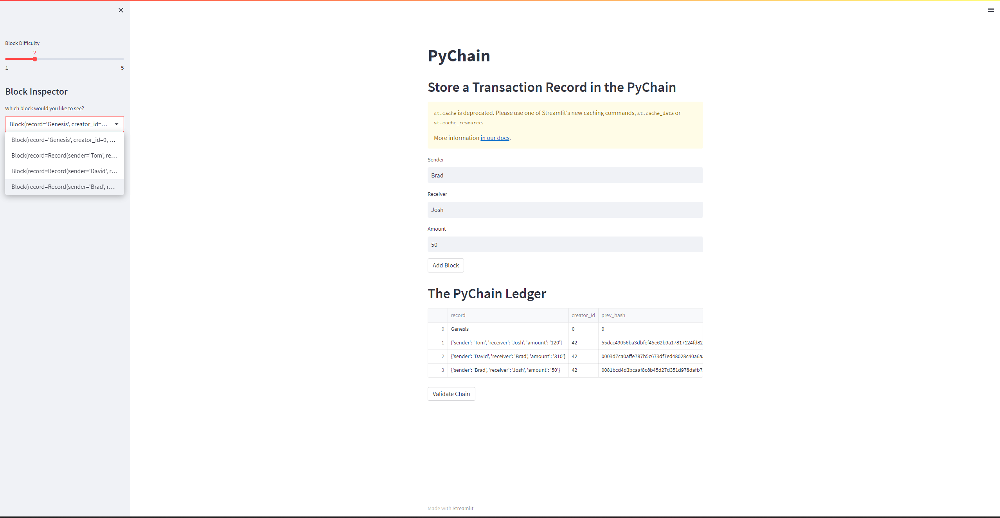
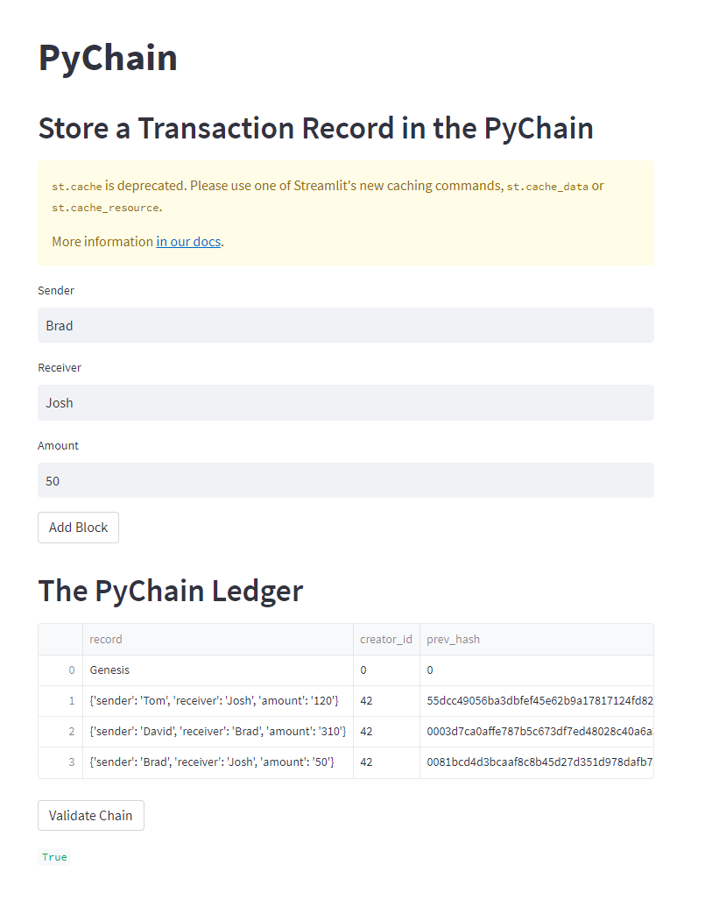

# pyChain

Blockchain-based ledger system, complete with a user-friendly web interface. 

This ledger will allow partner banks to conduct financial transactions (that is, to transfer money between senders and receivers) and to verify the integrity of the data in the ledger.

##Block contents and hashes

##Valid chain

